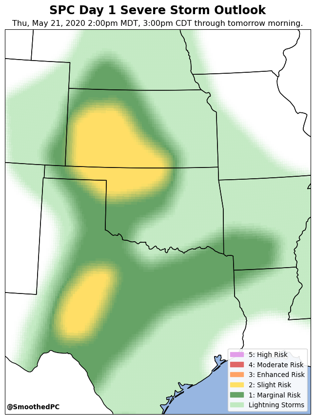
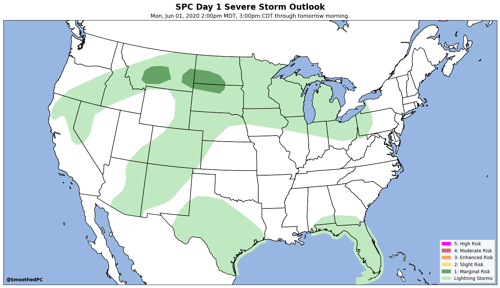

# severe
Code pertaining to SPC outlooks.

## grid_SPC_outlook.py
Creates a map of the current Day 1 SPC Categorical Outlook, but the polygon edges have been smoothed over a 25-mile distance.

If the risk is less than a Slight, creates a map showing the original polygon shape.

