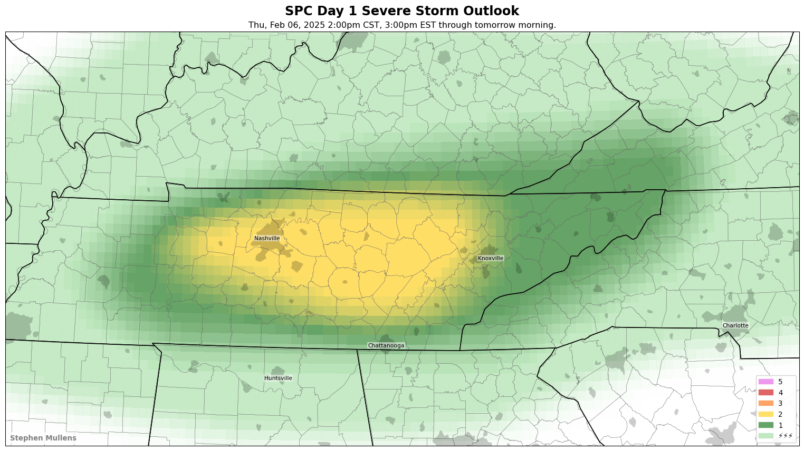
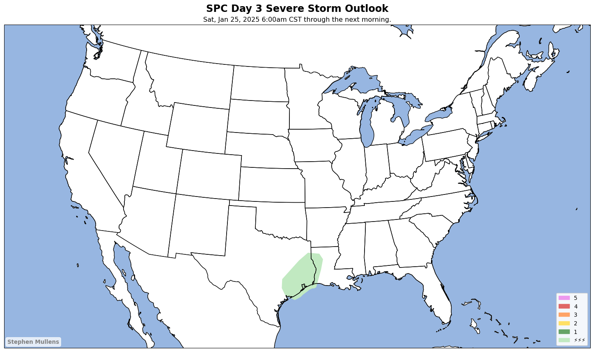
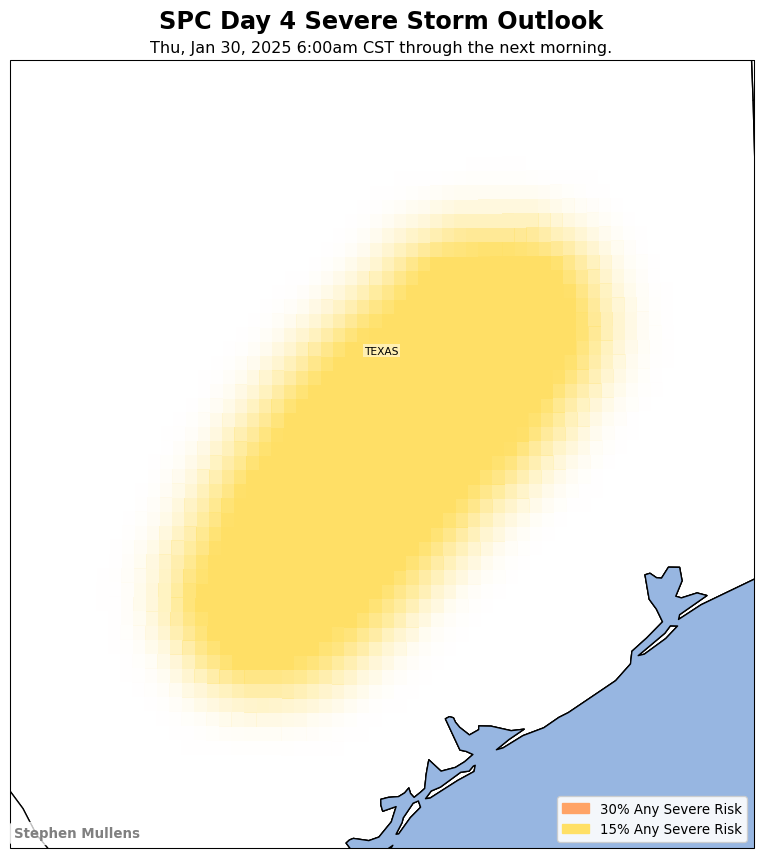
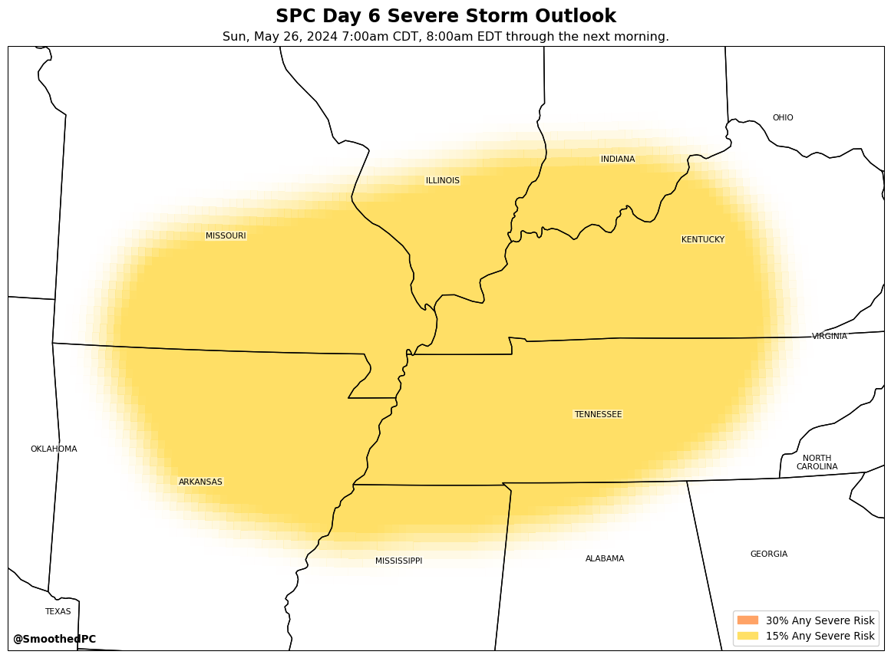
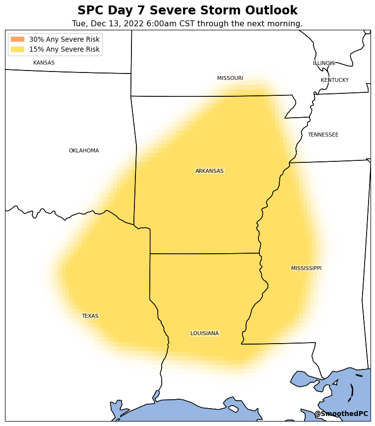

# severe
Code pertaining to SPC outlooks.

## grid_SPC_outlook.py
Creates a map of the SPC Categorical Outlooks as they are issued, but instead of showing the original polygons with hard borders, the polygon edges have been smoothed over a 25-mile radius.

If the Day 1-3 risk is less than a Slight Risk, the original unsmoothed polygon is plotted and the map is not tweeted. This is way faster to run. But it is saved here. The code is run using GitHub Actions.

## Features
1. RISKS: The code is built to focus on the area of greatest risk, but to never ignore other areas. The code is built to follow the polygons around the country, zooming in and out to reflect the forecast of what areas are at risk. With that said, we are only concerned with Slight Risk and above, because it is for the highest risks that people seek information that drives their future actions.
2. COLORS: While the colors have retained those used by the SPC, a custom colormap is created to allow for the desired smoothing effect at the polygon boundaries. Although the smoothed effect could be made "prettier" through filled contours, plotting an explicit grid retains the appearance that the data reflects a human-created forecast and is not a guarantee of the event outcome.
3. EXTENT: The map extent is determined objectively. The orthographic projection is used to reflect accurate feature sizes. Using this projection means the bottom middle of the image is farther north than intended, so an adjustment is made to assure polygons will remain on the created map. Alternatively, the ability to plot CONUS, regional, or state domains upon request has been implemented.
4. TWITTER: Maps are communicated through the Twitter bot account [@SmoothedPC](https://twitter.com/smoothedpc). SPC forecasts have always been intended for meteorologists and decision-makers such as emergancy managers, elected officials, first responders, etc. Those officials often get information through Twitter that inform their decisions and communications with their colleagues and the public. Positioning maps on that platform allows them to be easily grabbed and used. While the images are meant to improve decision-making, they aren't unique enough to demand officials go to another website that only has one thing on it.
5. THREAD: If multiple locations require their own risk areas from the SPC, each area gets its own unique map and tweet. Tweet threads help organize messages from a single issuance time in one location, starting with the highest risk area and progressing to the lowest risk.
6. LEGEND: Objectively determines which corner of the map contains the least important data, and places the legend there. The label for "General Thunderstorm Risk" has been changed to "Lightning Storms" to better indicate the risk and reflects a best practice commonly advocated for by Dr. Kevin Kloesel.
7. TIMEZONES: Uses the polygon vertices to determine which timezones should be included in the message. The timezones are then included from west to east to follow typical storm progression.
8. ARCHIVE: While the code is intended to run with operational data, the ability to override those settings to plot archived data, or to test code, has been implemented. 
9. SAVE: Saves images and data in subdirectories to keep the primary directory "clean."
10. CFEATURE: As the risk for severe weather increases, urban areas, counties, and roads are added to help officials determine their location. The data for the  geographical features are downloaded and saved locally to prevent having to rely on other websites being maintained.
11. DELAYS: If the polygons aren't published on time, the code can detect the delay and wait for the files to become available.
12. GRID: While a 0.1x0.1 degree grid is used to balance a smoothed look to the plots and to keep the time to create the plots to a minimum, the ability to decrease the grid size to 0.05x0.05 degrees or even 0.01x0.01 degrees is included. But the increase in the amount of time to create the maps is significant.
13. OTHER DATA: While only the SPC data is used for the moment, the locations of WPC excessive rainfall polygons, NHC tropical outlook, and the US drought monitor are provided for potential future use.

## Known Issues
1. The code has not been made flexible enough to plot archived data prior to 2020, which had different shapefile structures. Those shapefiles don't include all the data for each polygon. Most years keep polygons as single entities, so a different entry is needed for a separate polygon, even if the risk area is the same. Beginning in 2020, each entry indicates a unique risk area, with polygons being entered as multipolygons when needed.
2. The colors that indicate each risk are provided through hard-coded HEX codes. These colors have been provided in the shapefile formats provided by the SPC starting in 2020. At this time, I cannot determine what the HIGH risk color is supposed to be.

## Latest maps

### Day 1

### Day 2

### Day 3

### Day 4

### Day 5

### Day 6

### Day 7

### Day 8

