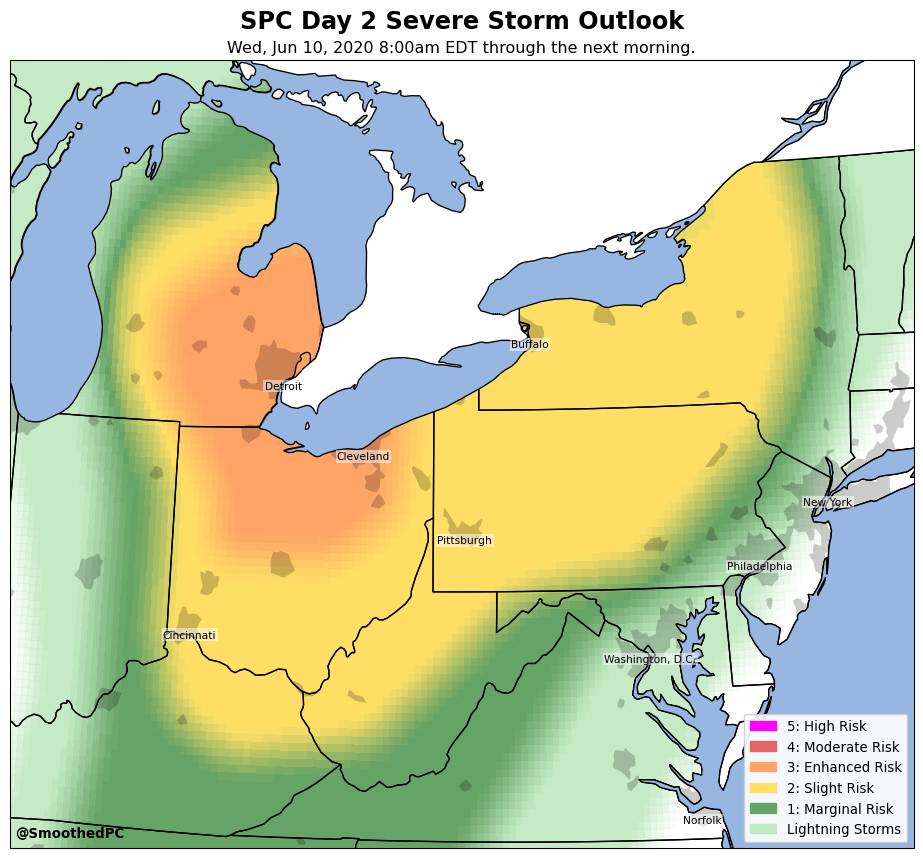
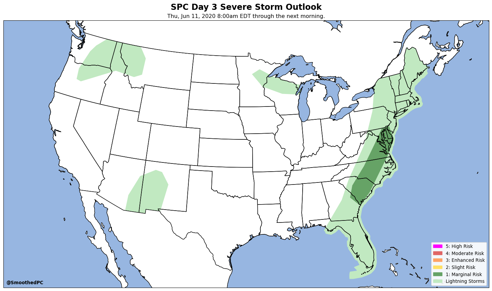

# severe
Code pertaining to SPC outlooks.

## grid_SPC_outlook.py
Creates a map of the current SPC Categorical Outlook, with the polygon edges smoothed over a 25-mile radius from each 0.1 x 0.1 degree grid location.

If the Day 1-3 risk is less than a Slight Risk, the map shows the original unsmoothed polygon shape. This is way faster to run. The map is not tweeted out, since it doesn't fulfill the expectation of the account. But it is saved here.

## Latest maps

### Day 1

### Day 2

### Day 3

### Day 4

### Day 5

### Day 6

### Day 7

### Day 8

